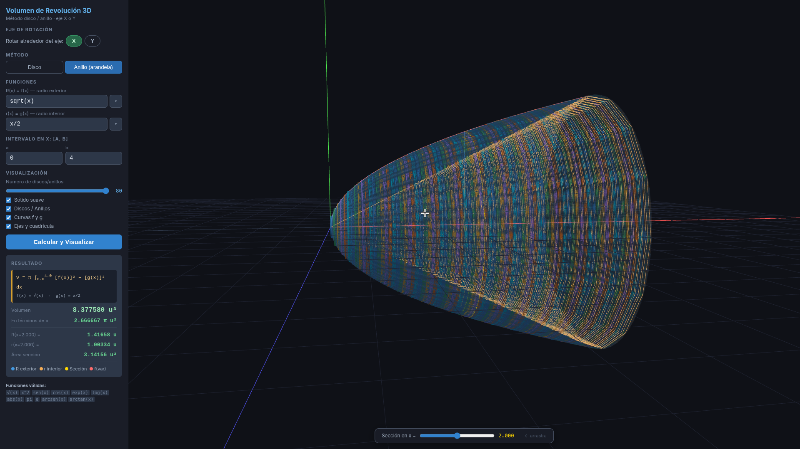
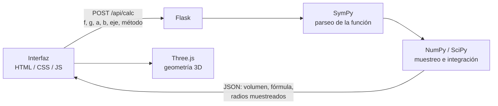
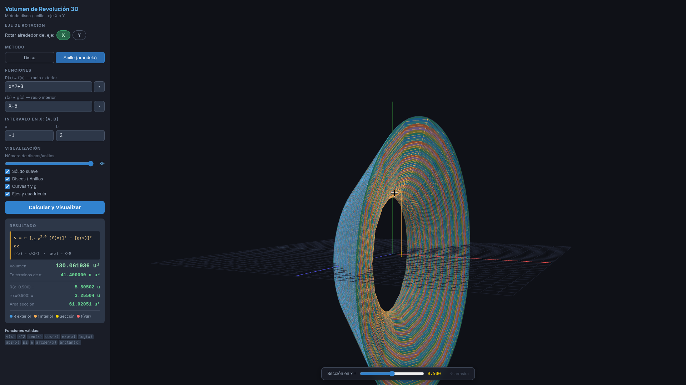

# Simulador 3D de Volumen de Revolución

Aplicación de escritorio para **visualizar y calcular volúmenes de sólidos de revolución** con el método de disco y el de anillo (arandela), alrededor del eje X o del eje Y. Escribes una función, eliges el intervalo y ves el sólido en 3D junto con el volumen calculado por integración numérica.

Lo hice como apoyo para Cálculo: la fórmula se entiende mucho mejor cuando puedes girar el sólido y ver cómo se apilan los discos.



## Funcionalidades

- **Métodos:** disco y anillo (arandela), con rotación alrededor del eje X o del eje Y.
- **Entrada de funciones flexible:** acepta `x^2`, `√(x)`, `sen(x)`, `arcsen(x)`, superíndices (`x²`) y multiplicación implícita (`2x`, `(1/8)x`), con la variable que corresponda al eje (`f(x)`, `f(y)`…). Incluye un menú para insertar funciones.
- **Cálculo del volumen** con integración numérica (`scipy.integrate.quad`), con Simpson como respaldo si `quad` falla. Muestra el resultado en decimal y en términos de π.
- **Visualización 3D interactiva:** sólido suave, discos o anillos individuales (de 2 a 80), curvas f y g, y ejes. La cámara es orbital.
- **Sección transversal móvil:** un deslizador recorre el intervalo y muestra el radio y el área de la sección en cada punto.
- **Rendimiento:** las capas se generan como geometría hueca real y se fusionan en pocas mallas, así que el framerate se mantiene con muchos discos.
- **Ejecutable para Windows** empaquetado con PyInstaller, que abre en una ventana nativa (pywebview) en lugar del navegador.

## Cómo funciona



El backend normaliza la expresión (superíndices, `^`, funciones en español, multiplicación implícita), la convierte con SymPy en una función de NumPy, muestrea 300 puntos del intervalo para la geometría y calcula el volumen:

- Disco: V = π ∫ₐᵇ [f(x)]² dx
- Anillo: V = π ∫ₐᵇ ( [R(x)]² − [r(x)]² ) dx

Si el usuario escribe las funciones al revés, el radio exterior y el interior se ordenan automáticamente en cada punto.

### Ejemplos para comprobar el resultado

| Método | Funciones | Intervalo | Volumen esperado |
|---|---|---|---|
| Disco, eje X | f(x) = √x | [0, 4] | 8π ≈ 25.133 |
| Anillo, eje X | f(x) = √x, g(x) = x/2 | [0, 4] | 8π/3 ≈ 8.378 |
| Anillo, eje X | f(x) = x² + 3, g(x) = x + 5 | [−1, 2] | 41.4π ≈ 130.062 |

En el último ejemplo las curvas se cortan justo en x = −1 y x = 2, y el simulador detecta solo cuál es el radio exterior:



## Tecnologías

**Backend:** Python, Flask, NumPy, SciPy, SymPy
**Frontend:** JavaScript (módulos ES), Three.js, HTML, CSS
**Escritorio:** pywebview, PyInstaller

## Instalación y uso

```sh
git clone https://github.com/TheAndy509/simulador-de-volumen.git
cd simulador-de-volumen
python -m venv venv
```

### Windows (ventana de escritorio)

```sh
venv\Scripts\activate
pip install -r requirements.txt
python launcher.py
```

Para generar el ejecutable:

```sh
pyinstaller simulador.spec
```

El `.exe` queda en `dist/SimuladorDeVolumen.exe`.

### Linux / macOS (en el navegador)

El ejecutable y el `.spec` están pensados para Windows. En otros sistemas basta con instalar las dependencias del cálculo y abrir la app en el navegador:

```sh
source venv/bin/activate
pip install flask numpy scipy sympy
python app.py
```

Después abre `http://127.0.0.1:5050`.

## Estructura

```
simulador-de-volumen/
├── app.py            # API Flask: parseo, muestreo e integración
├── launcher.py       # Ventana de escritorio con pywebview
├── simulador.spec    # Configuración de PyInstaller
├── requirements.txt
├── templates/
│   └── index.html    # Interfaz
└── static/
    ├── main.js       # Escena Three.js y lógica de la interfaz
    └── style.css
```

## Seguridad

Cambios aplicados tras revisar el código:

- El debugger de Flask queda desactivado por defecto; solo se activa con `FLASK_DEBUG=1`.
- Las funciones escritas por el usuario se escapan antes de insertarlas en el HTML de la fórmula, para evitar XSS.
- El eje de rotación recibido del cliente se valida (`x` o `y`).
- Three.js está incluido en `static/vendor`, así que la app funciona sin conexión y no depende de un CDN externo.

Pendiente: la entrada de funciones se procesa con `sympify` de SymPy, que internamente usa `eval`. Es aceptable en una app local de un solo usuario, pero **no debe exponerse en un servidor público** tal como está.

## Limitaciones conocidas

- El ejecutable solo se genera para Windows.

## Autor

**Anndré** — estudiante de la Universidad Tecnológica de Panamá
GitHub: [@TheAndy509](https://github.com/TheAndy509)
